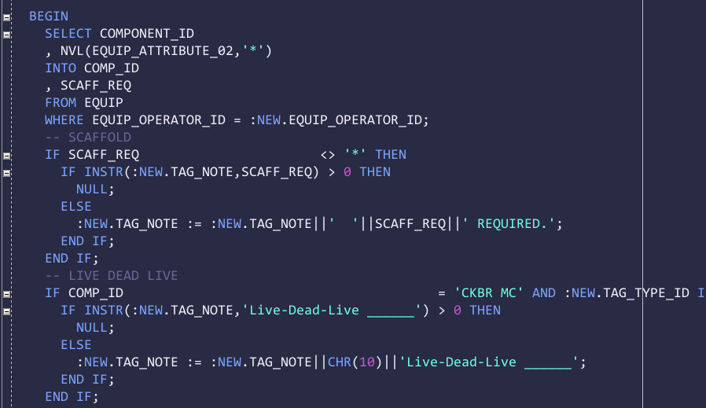
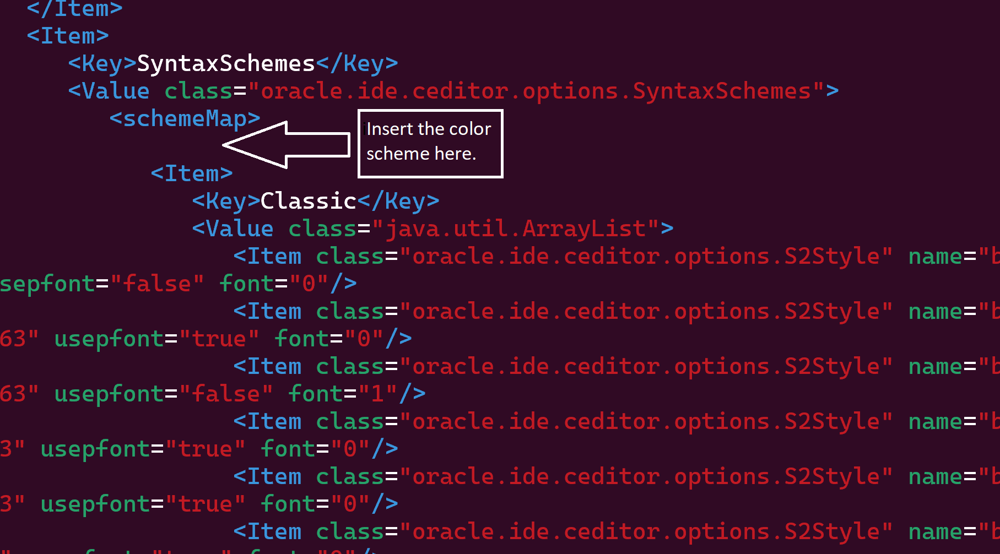
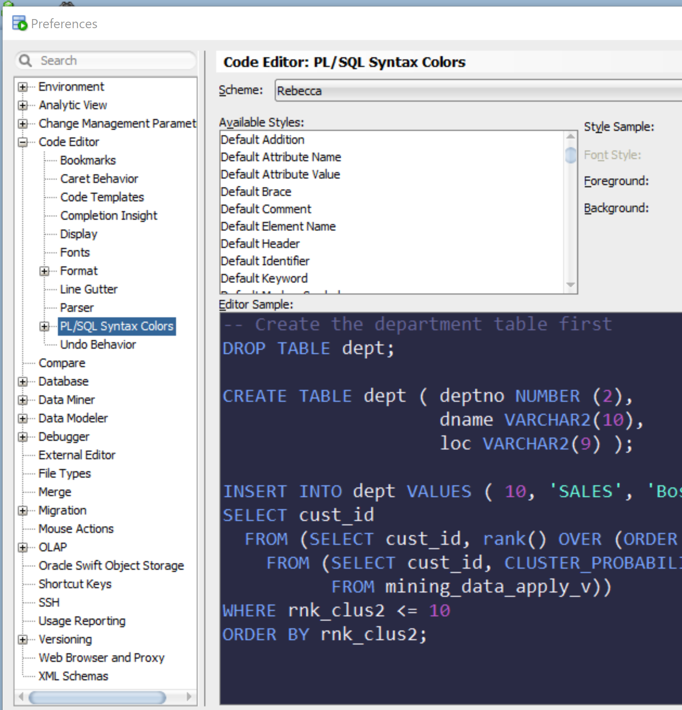

# Rebecca color scheme for Oracle SQL Developer #

This is a spinoff of revecca-theme color scheme for Oracle SQL Developer. It is based on [rebecca-theme for emacs by vic] (https://github.com/vic/rebecca-theme).

## Installation ##

Unfortunately Oracle doesn't make it easy to import a new color schemes into SQL Developer, thus a little bit of hacking is required.

- Close SQL Developer. This is important. If you modify the scheme file while SQL Developer is open, your changes won't be saved.

- Locate file `dtcache.xml` in the SQL Developer's settings directory. On my system it is located in directory `/.sqldeveloper/system23.1.1.345.2114/o.ide.12.2.1.6.42.220506.654`

- Locate `<schemeMap>` tag inside dtcache.xml file. Insert the content of [`rebecca-scheme.xml`](https://raw.githubusercontent.com/nukecoder/rebecca-sqldeveloper/main/rebecca-scheme.xml) file inside `<schemeMap>` alongside the other colour schemes. Be careful not to break the XML.

- Launch SQL Developer. Navigate to menu Tools -> Preferences, then select item Code Editor -> PL/SQL Syntax Colors in the left pane.

- Select "Rebecca" in the "Scheme" drop down list on the top.

